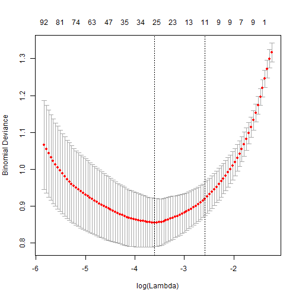
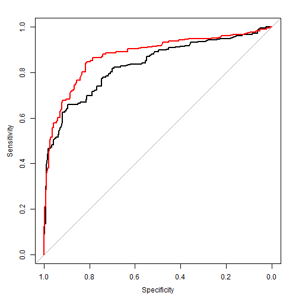

## Using Timbr

`timbr` is a new R package that makes it easy to extract useful information from
R's popular decision tree objects. With `timbr` we can create thousands of new
interaction variables in a short time. With a quick post-processing step, we 
can run all of these interaction variables, or rules, through `LASSO` regression
to quickly identify potential predictors to add to our models.

## Data Preparation

Throughout this tutorial, we will be using the familar titanic dataset that
comes installed with `mjollnir`. Before we begin, we must do a little house-
keeping to set up our workspace with the libraries we need and set the seed for
our random number generation.


```r
library(timbr)
library(mjollnir)
data(titanic)
set.seed(123) # set the seed for reproducible results!

# let's sample the data first by taking a random 50% of records
dev <- sample(nrow(titanic), nrow(titanic) / 2)
```

## Baseline Model

We are first going to make a simple logistic regression model and see how
`timbr` can be used to find new interactions worth exploring. The following code
fits a model in the same way as SAS's `proc glm`. The syntax  for R is a bit
more concise.


```r
# a simple logistic regression model
lm <- glm(Survived ~ Fare + Sex, data=titanic[dev,], family='binomial')
print(lm)
```

```
## 
## Call:  glm(formula = Survived ~ Fare + Sex, family = "binomial", data = titanic[dev, 
##     ])
## 
## Coefficients:
## (Intercept)         Fare      Sexmale  
##     0.56693      0.01708     -2.53983  
## 
## Degrees of Freedom: 444 Total (i.e. Null);  442 Residual
## Null Deviance:	    587.9 
## Residual Deviance: 414.3 	AIC: 420.3
```

```r
# predict the model on the validation data
phat <- predict(lm, titanic[-dev,])

# print the ks value
ks.table(phat, titanic$Survived[-dev], n.bins = 10)$ks
```

```
## [1] 0.5010943
```

We now have a fully working logistic regression model with two terms. Pretending
for a moment that this model was built in `Xeno`, we would call our model
finished. 

But what about insights we might not think of? `timbr` provieds a fast, cheap
method for generating simple interaction rules that are predictive and may
provide additional lift when added to a model.

The concept of `timbr` is to wrap a decision tree object into a simple,
easy-to-use object called a `lumberYard`. The `lumberYard` allows you to extract
all sorts of useful tidbits from the underlying decision tree model.

## Generating rules using a Random Forest

We are going to build a `randomForest` and use `timbr` to create a `lumberYard`
out of it. We will use this `lumberYard` to create thousands of indivual rules
which correspond to the nodes of the decision trees.

A `randomForest` is an *ensemble* technique that builds hundreds of decision
trees and averages them together in some manner. Unlike `gbm` which creates its
decision trees by adding the best available variable at each split,
`randomForest` *randomly samples* predictors at every split and *then* picks the 
best one. The advantage of this approach is that it introduces variable
combinations that would not otherwise be discovered.

Let's attempt to build a quick `randomForest` with the following code.


```r
library(randomForest)
rf <- randomForest(x = titanic[dev,-1], y = factor(titanic$Survived[dev]),
                   maxnodes = 8, ntree = 100)
```

```
## Error in randomForest.default(x = titanic[dev, -1], y = factor(titanic$Survived[dev]), : NA not permitted in predictors
```

What happened? This generates an error because `randomForest` does not allow
missing values. We must impute them using a utility function included in `timbr`


```r
df <- imputeMissing(titanic)
rf <- randomForest(x = df[dev,-1], y = factor(df$Survived[dev]), maxnodes = 8,
                   ntree = 100)
```

Note that the `y` variable is surrounded by the `factor` function. In order to 
use `randomForest` for classification instead of regression, the dependent
variable must be a `factor`.

## Creating a lumberYard

Creating a `lumberYard` from a `randomForest` object is easy, though it can take
a while if your ensemble has a great many trees and nodes. Simply wrap your
`gbm` or `randomForest` object in the `lumberYard` function.


```r
ly <- lumberYard(rf)
```

The insides of a `lumberYard` are neatly hidden away and don't ever need to be
accessed for routine use. But in general, it is a massive collection of `nodes`
that have been translated from the underlying tree models. We can inspect the 
`nodes` with `printNodes` and a vector of node IDs.


```r
printNodes(ly, 1) # first split left
```

```
## NodeID:     1
## ------------------
## Embarked in c('','C')
```

```r
printNodes(ly, 2) # first split right
```

```
## NodeID:     2
## ------------------
## Embarked in c('Q','S')
```

```r
printNodes(ly, 3) # child of first split
```

```
## NodeID:     3
## ------------------
## Embarked in c('','C')
## Fare <= 30.1
```

```r
printNodes(ly, c(1, 5, 10)) # multiple nodes
```

```
## NodeID:     1
## ------------------
## Embarked in c('','C') 
## 
## NodeID:     5
## ------------------
## Embarked in c('Q','S')
## SibSp <= 1.5 
## 
## NodeID:    10
## ------------------
## Embarked in c('','C')
## Fare > 30.1
## Pclass in c('2','3')
```

`printNodes` takes some optional data arguments for reporting performance as
well. We will explore that usage later in the tutorial.

More importantly, we can *predict* nodes which is what we will use to find
new and interesting rules. Why not just use all of them? Because there are far
too many nodes to use an exhaustive search. However, by using `LASSO`
regression, we can focus on the most important predictors.

## Generating the nodes


```r
# predictions from lumberyard
nodes <- predict(ly, df[dev,-1], type = 'All')
dim(nodes)
```

```
## [1]  445 1400
```

```r
head(nodes[1:5,1:5]) # sample of what matrix looks like
```

```
##      [,1] [,2] [,3] [,4] [,5]
## [1,]    1    0    0    1    0
## [2,]    0    1    0    0    1
## [3,]    0    1    0    0    1
## [4,]    0    1    0    0    1
## [5,]    0    1    0    0    1
```

Becuase we specified a `maxnodes` of 8 when we created the `randomForest` we
created 14 nodes per tree. `maxnodes` specifies the number of *terminal* nodes.
Every pair of nodes has one parent so the total nodes possible in a tree is with
a `maxnodes` value of 8 is:

$$8 + 4 + 2 = 14$$

Our initial forest created 100 trees each with 14 nodes for a total of 1,400
generated rules! How are we going to separate the chaff from the wheat? With
`LASSO` regression.

## Massaging our nodes

Recall that `LASSO` regression is exactly the same as logistic regression with
one important addition. A slight tweak to the fitting algorithm is made such 
that unimportant or redundant variables are shrunk away to zero. What we are
left with is a very sparse model. In our case, we will be left with the most
important "rules" in our dataset.

Before we begin, though, we have to massage our nodes just a bit. `randomForest`
does not support a minumum observations in terminal nodes option like `gbm` so
we have to make sure our nodes don't have counts that are too small for our
comfort.


```r
# create a vector of the node counts
cnts <- apply(nodes, 2, function(x) min(sum(x == 0), sum(x == 1)))
summary(cnts)
```

```
##    Min. 1st Qu.  Median    Mean 3rd Qu.    Max. 
##    1.00   23.75   58.00   77.29  132.20  222.00
```

Roughly a quarter of our nodes have fewer than 25 observations in the terminal
node. This is a little too many for my comfort so I am going to zero out the 
nodes by using a convenience function from `timbr`.


```r
nodes <- dropSmallNodes(nodes, 25)
cnts <- apply(nodes, 2, sum)
summary(cnts[cnts > 0])
```

```
##    Min. 1st Qu.  Median    Mean 3rd Qu.    Max. 
##    25.0    48.0    88.0   126.9   190.0   420.0
```

We now have a nodes matrix where nodes are either ALL zero, or have a minimum
of 25 observations. We are ready to find out which ones are the most predictive.

## Finding predictive rules

Creating a LASSO regression is easy with our nodes matrix and a target variable.
We just need to remember to load the library and pass in the appropriate 
arguments to the function.


```r
library(glmnet)

fit <- cv.glmnet(x = nodes, y = df$Survived[dev], alpha = 1,
                 family = 'binomial', nfolds = 5)
plot(fit)
```

 

We just trained a LASSO regression model on our dataset five times. The plot
shows our cross-validated error as a function of the number of predcitors in our
model. Remember, we started with 1,400 predictors and the plot shows that only 
using 27 produces the best cross-validated model!


```r
# get a list of the best predictors
betas <- coef(fit, s = 'lambda.min')[-1]
best <- which(betas != 0) # gives us the nodes that aren't zeroed out!
best
```

```
##  [1]    6   53  174  188  315  343  355  363  389  401  420  511  537  571
## [15]  667  820  869  870  915 1043 1045 1048 1089 1189 1384
```

```r
# sort by absolute value of the coefficient ** not necessary **
best <- best[order(-abs(betas[best]))]
```

To find out which nodes are the most predictive, we need to work with the `coef`
function from the `glmnet` library. By passing in 'lambda.min' we are asking for
the coefficients that give us the best performing model on the cross-validation.

## Printing out the best rules

Now that we know *which* rules are the most predictive. Let's see what they look
like.


```r
# print just the node text for nodes 1 and 3
printNodes(ly, best[c(1,3)])
```

```
## NodeID:  1384
## ------------------
## SibSp <= 2.5
## Parch <= 0.5
## Fare > 52.2771
## Pclass in c('1','3') 
## 
## NodeID:  1189
## ------------------
## Sex in c('female')
## Embarked in c('','C','Q')
## Parch <= 1.5
## Age <= 29
```

By passing a dataset and response variable into the `printNodes` function we can
also generate performance statistics for the node.


```r
# let's see how the sixteenth node performs
printNodes(ly, best[16], df[dev,-1], df$Survived[dev])
```

```
## NodeID:    53
## ------------------
## Sex in c('male')
## Age > 1.5
## Fare <= 52.2771 
## 
## Performance:
##    node y.totN y.sumY y.meanY
## 1 FALSE    183    130    0.71
## 2  TRUE    262     36   0.137
```

Based on the results for this node, if you were potty-trained male with a cheap
ticket, you didn't fare too well during the sinking of the Titanic.


```r
# And by contrast, the second node
printNodes(ly, best[2], df[dev,-1], df$Survived[dev])
```

```
## NodeID:   389
## ------------------
## Sex in c('female')
## SibSp <= 5
## Pclass in c('1','2')
## Age <= 56.5 
## 
## Performance:
##    node y.totN y.sumY y.meanY
## 1 FALSE    365     89   0.244
## 2  TRUE     80     77   0.963
```

Young or married females in first and second class with family members aboard
were likely to make it off the ship alive. Women and children first indeed!

## Now what?

Once we find out the nodeIDs of our most predictive nodes we would like to do
something with them. Typically this will involve bringing them into another
model to see if they provide lift. You can easily write them to csv with the
follwing notation.


```r
bestNodes <- data.frame(predict(ly, df[-1], i = best, type = 'Nodes'))
colnames(bestNodes) <- paste('Node', best, sep='_')
```

And write it to disk


```r
write.csv(bestNodes, file = "Path/To/My/File.csv")
```

It is then very easy to bring these new features into Xeno to assess whether 
they provide value or not. It is not very helpful to see a bunch of generically
named flag variables; however, so we should also print out the node text for
reference. This is also straightforward by enclosing the `printNodes` function
in a `sink` sandwich.


```r
sink("Path/To/My/NodeReference.txt")
printNodes(ly, best)
sink()
```

## What about that baseline model

We can do more than just output new fields into Xeno, though. Let's see if any
of our flags want to come into our logistic regression model. Let's add just the
top two nodes to our dataset and see how the logistic model performs.

First we will add our best-performing nodes to the original titanic dataset.

```r
# add our best nodes to the titanic dataset
df2 <- cbind(titanic, bestNodes)
```

Next, we will grow a logistic regression model starting with just an intercept.
We will apply forward stepwise regression to build a logistic model just like
we would in SAS.

In R we grow a model by telling the `step` function what the initial model looks
like and what the *saturated* model looks like. In this case, the initial model
is simply an intercept. The saturated model contains all of the variables in
our original titanic dataset.


```r
# create an intercept only model
int.only <- glm(Survived~1, df2, family = 'binomial')

# forward stepwise regression to build a base logistic regression model
base <- step(int.only, Survived ~ Fare+Sex+Pclass+SibSp+Parch,
             direction="forward")
```

We can then use our final base model as the *initial* model in another stepwise
regression. This time, the saturated model will contain all of our best nodes
as well.


```r
# create a new model formula adding the nodes
add <- formula(paste0("~ . +", paste(colnames(bestNodes), collapse = " + ")))

# the update function takes an existing formula and modifies it
f2 <- update(formula(base), add)
              
# forward stepwise regression adding nodes to the base logistic model
full <- step(base, f2, direction="forward")
```

We now have two logistic regression models. One built using main effects only
which simulates the Xeno modeling process and one consisting of the same model
with the added possibility of using additional interaction nodes.

We can compare the results of each model and plot their ROC curves.


```r
# score the base model and the model w/Nodes on the VALIDATION data sets
phat.original <- predict(base, titanic[-dev,])
phat.wNodes <- predict(full, df2[-dev,])

# ks of original
ks.table(phat.original, titanic$Survived[-dev])$ks
```

```
## [1] 0.5553872
```

```r
# ks with Nodes
ks.table(phat.wNodes, titanic$Survived[-dev])$ks
```

```
## [1] 0.6594276
```

Plotting the ROC curves we see the interaction nodes did indeed add 
considerable lift to the model (red curve).

 


